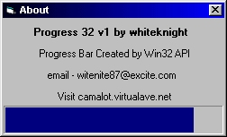



## API Created Progress Bar

### Description

this is the source to a dll that will create a progressbar anywhere on a form you want. Different border stlyes, change the backcolor, change the bar color, make it the default style progressbar or use vertical, smooth, or vertical-smooth. This is just the base of the dll, more can be added to it to make it more like you want it.

If you want to include a progressbar in your app but don't want to send the LARGE Commoncontrols.ocx then just use this and send a small dll file with your app.

Please post your comments / questions and don't foreget to vote.

whiteknight
 
### More Info
 

             |
---                |---
**Submitted On**   |2001-01-31 18:55:18
**By**             |[whiteknight](https://github.com/Planet-Source-Code/PSCIndex/blob/master/ByAuthor/whiteknight.md)
**Level**          |Advanced
**User Rating**    |4.5 (45 globes from 10 users)
**Compatibility**  |VB 4\.0 \(32\-bit\), VB 5\.0, VB 6\.0
**Category**       |[Windows API Call/ Explanation](https://github.com/Planet-Source-Code/PSCIndex/blob/master/ByCategory/windows-api-call-explanation__1-39.md)
**World**          |[Visual Basic](https://github.com/Planet-Source-Code/PSCIndex/blob/master/ByWorld/visual-basic.md)
**Archive File**   |[CODE\_UPLOAD143801312001\.zip](https://github.com/Planet-Source-Code/whiteknight-api-created-progress-bar__1-14886/archive/master.zip)

